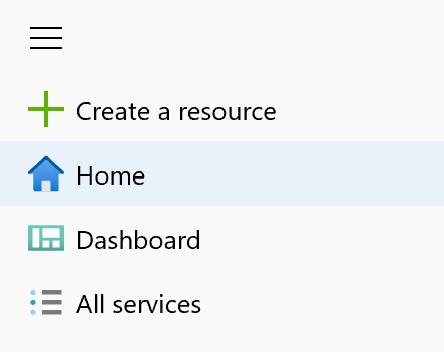

# Prerequisites

In order to start with the following labs, we first need to setup our Workshop Environment.

We will need the following things to get started:

* An active [Microsoft Azure Subscription](https://azure.microsoft.com/)
* Access to an [Azure DevOps Tenant](https://azure.microsoft.com/en-US/services/devops)
* An [Azure Web App](https://azure.microsoft.com/en-US/services/app-service/web) with multiple deployment slots
* An [Azure MySQL Database](https://azure.microsoft.com/en-US/services/mysql)

## Microsoft Azure Subscription

We need an active Azure Subscription in order to spin up some resources in Azure.
There are multiple ways of accessing an Azure Subscription. Below you will find ways on how to get a free Azure SUbscription for this workshop.

### Existing Azure Subscription

If you already have access to an Azure Subscription please use the [Azure Portal](https://portal.azure.com/) to login to your environment.

### Activating an Azure Pass

If you got an Azure Pass during an Event or a Meetup activate it at the [Microsoft Azure Pass Website](www.microsoftazurepass.com).

If you need further support review the [Redemption Process Guide](https://www.microsoftazurepass.com/Home/HowTo)

### Free Azure trial Account

If you just want to test Azure or just want to use the free services [register here](https://azure.microsoft.com/en-us/free/) for a free Azure Account.

### Check for existing Subscription

> [!WARNING]
> Before continuing, please make sure that you have access to at least one Subscription. Follow the instructions below to check for a Subscription.  

First login to the Azure Portal via [portal.azure.com](https://portal.azure.com)

Then click on the "All Services" Button on the Azure sidebar in the left of the portal.



Now select "Subscriptions" in order to get an overview about all Subscriptions which are associated to you.


You should at least see one Subscription in this overview. If not please create a free Subscription as described earlier or contact your IT-Administrator.

## Azure DevOps Tenant

We will use a free [Azure DevOps Tenant](https://azure.microsoft.com/de-de/services/devops/) for this workshop.

Please check if you already have access to a Azure DevOps Organisation by navigating to [dev.azure.com](https://dev.azure.com).

If you dont see an organization aftet the login follow the assisten to create one or ask your IT-Administrator to add you to an existing Org.

## Demo Project/MyShuttle Setup

In this Workshop we will use the [MyShuttle App](https://github.com/mrmubi/myShuttle) as application which we want to deploy in our Azure Environment. In order to get the Source Code we need to setup the MyShuttle App in our Azure DevOps organization.

To do so please follow the following instructions:

1. Login to the [Azure DevOps Demo Generator](https://azuredevopsdemogenerator.azurewebsites.net)

2. Select your Azure DevOps Organization and name the Project "MyShuttle App"

3. Select the MyShuttle App as "Selected Template"


4. Klick on "Create Project"

After the process is done, proceed to your My Shuttle App project in Azure DevOps.

## Azure Web App

We will deploy the My Shuttle App to an [Azure Web App](https://azure.microsoft.com/en-US/services/app-service/web).
[Azure Web App](https://azure.microsoft.com/en-US/services/app-service/web) is a PaaS serviced managed by Microsoft which will run your source code, deployable or container for you, so you dont have to worry about operation.

We will need one Azure Web App for this Workshop, so please proceed with the instructions below in order to setup your WebApp.

1. Open the [Azure Portal](https://portal.azure.com) and klick on "Create a resource" in the upper left corner of the Portal.


2. Select "Web App from the Getting started tab


3. Create a new Resource Group and name it as you want. This Resource Group will store all of the Azure resources we will use in our workshop.


4. Fill in the information of the wizard.

**Name**: (The name of your webapp. Use a unique name like: mynamewebapp2019)

**Publish**: Code

**Runtime stack**: Tomcat 9.0 - Java 11

**Operating system**: Windows (App would also run on Linux)

**Region**: West Europe (If you are not located in Europe use one of the Azure  regions in you continent.)

**Sku and size**: Change the size like in the picture below


5. Change the SKU size to S1 which will be enough for this workshop.


6. Click on "Review + create" in order to finish the setup.


7. Click "Create" after the validation is done to start the deployment.


## Azure MySQL Database

The MyShuttle App also needs a Database in order to run properly. We will use [Azure Database for MySQL](https://azure.microsoft.com/en-us/services/mysql/) as fully managed Cloud Database service.

Follow the instructions below to setup your Database in Azure.

1. Open the [Azure Portal](https://portal.azure.com) and klick on "Create a resource" in the upper left corner of the Portal.


2. Enter MySql in the search bar and select "Azure Database for MySQL"


3. Klick "create" to start the deployment wizard.


4. Fill in the information of the wizard. Then click "Review + create"

**Resource Group**: (Use the same Resource group as for the Web App)

**Server name**: (The name of your database. Use a unique name like: mynamedatabase2019)

**Data source**: None

**Admin username**: dbadmin

**Password**: (A unique password. Please remeber the password we need it later)

**Confirm password**: (Same password like above)

**Location**: West Europe (If you are not located in Europe use one of the Azure  regions in you continent.)

**Version**: 5.7

**Compute and storage**: Keep the existing value (Genral Purpose[4 Core, 100Gb storage])


7. Click "Create" after the validation is done to start the deployment.


## Configure WebApp

We need to connect the WebApp with the newly created MySQL Database

Wait for done

Settings --> Connection Security ---> Allow Access to Azure Services ON

Settings --> Properties

Copy ServerName and LogOnName to local Editor Window


```jdbc:mysql://{MySQL Server Name}:3306/alm?useSSL=true&requireSSL=false&autoReconnect=true&user={your user name}&password={your password}```

Replace with own settings

## Deployment Slots for Azure WebApp

New Connection String --> Name: MyShuttleDb Value: PASTE string from above

New Slot: Staging (inherit from Prod)
