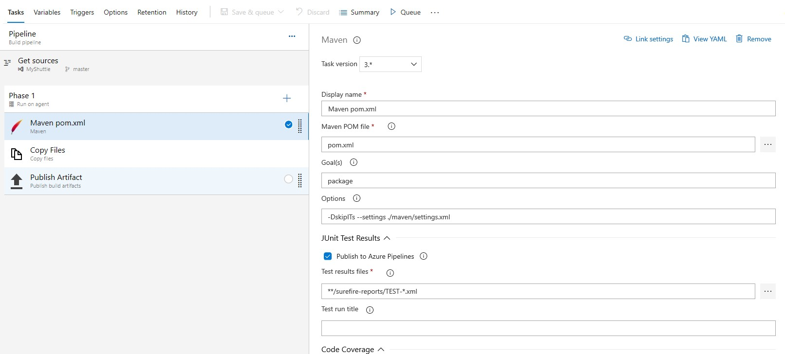
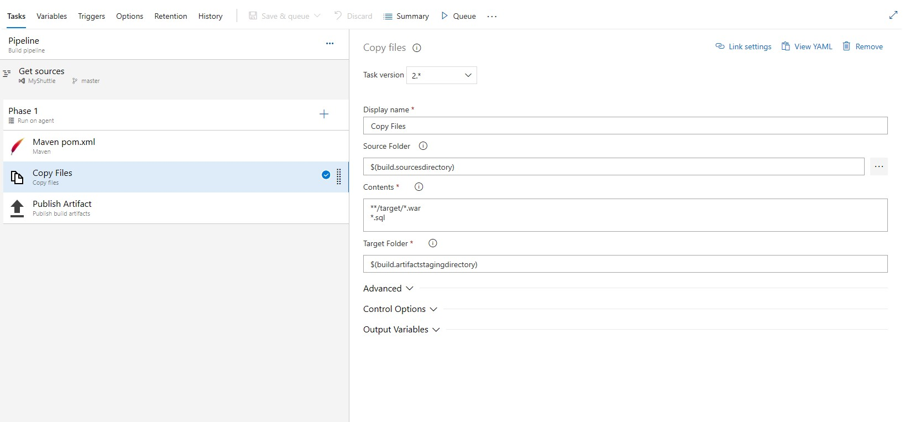
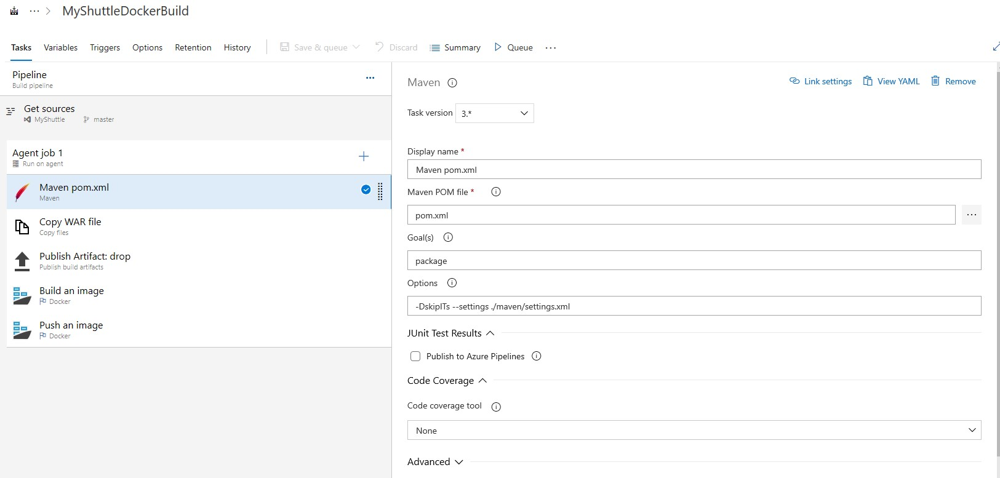

# Setup Azure Build Pipeline

Setup Build Pipeline

Including Tests

Enable CI for Master

Enforce Branch policy = Approval by one (self allowed)

Wait for build Job

Get Badge Markdown

New Branch 

Add Badge

Create PR

DO NOT APPROVE

## Backup

### Build Definition Maven

#### UI





#### YAML

```yaml
pool:
  name: Hosted Ubuntu 1604
  demands: maven

steps:
- task: Maven@3
  displayName: 'Maven pom.xml'
  inputs:
    options: '-DskipITs --settings ./maven/settings.xml'


- task: CopyFiles@2
  displayName: 'Copy Files'
  inputs:
    SourceFolder: '$(build.sourcesdirectory)'
    Contents: |
     **/target/*.war
     *.sql
    TargetFolder: '$(build.artifactstagingdirectory)'

- task: PublishBuildArtifacts@1
  displayName: 'Publish Artifact'
  inputs:
    PathtoPublish: '$(build.artifactstagingdirectory)'
```

### Build Definition Docker

#### UI



#### YAML

```yaml
pool:
  name: Hosted Ubuntu 1604
  demands: maven


steps:
- task: Maven@3
  displayName: 'Maven pom.xml'
  inputs:
    options: '-DskipITs --settings ./maven/settings.xml'
    publishJUnitResults: false


- task: CopyFiles@2
  displayName: 'Copy WAR file'
  inputs:
    SourceFolder: '$(build.sourcesdirectory)'
    Contents: |
     target/myshuttledev*.war
     *.sql
    TargetFolder: '$(build.artifactstagingdirectory)'


- task: PublishBuildArtifacts@1
  displayName: 'Publish Artifact: drop'
  inputs:
    PathtoPublish: '$(build.artifactstagingdirectory)'


- task: Docker@1
  displayName: 'Build an image'
  inputs:
    dockerFile: src/Dockerfile
    imageName: 'Web:$(Build.BuildNumber)'
    includeLatestTag: true
    useDefaultContext: false
    buildContext: .

- task: Docker@1
  displayName: 'Push an image'
  inputs:
    command: 'Push an image'
    imageName: 'Web:$(Build.BuildNumber)'
```
