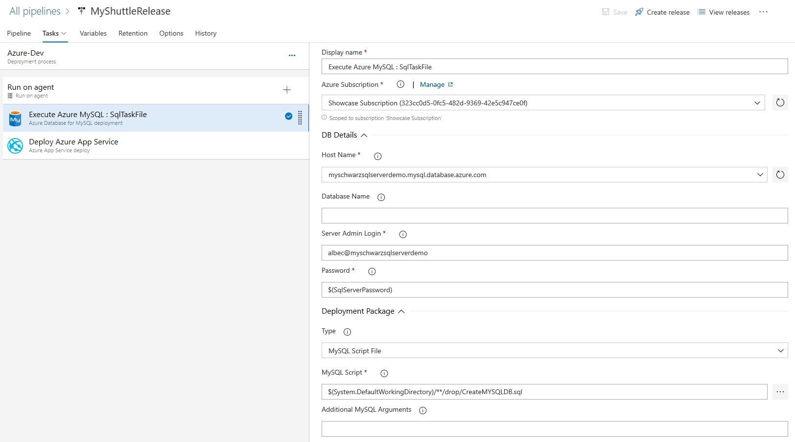
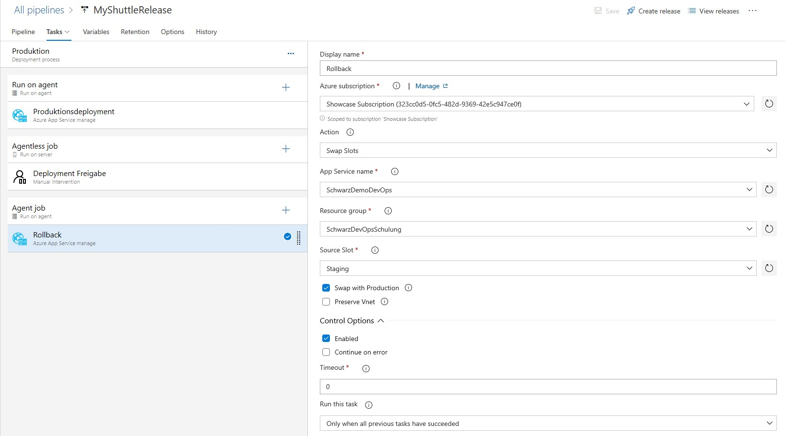

# Azure DevOps Release

Setup two Stages and deploy artifact from build to Azure Web App.

## PreProd Stage

### Azure Database for MySQl Task

Connect with Azure Resources (Database)

Login Name from local Editor window

Password into Build Var 

DeploymentPackage 
Type: MySQL Script File
Script: Path to *.sql

### WebApp Deployment

Deploy to WebApp Slot Staging

## Production

### Swap Slots Job

Just Swap Staging with Prod

### Agentess Job

Ask for validation

### Rollback

Rollback only if a previous job has failed

Swap slots back 

## Access WebApp

<WebAppName>/myshuttledev/

|Username |Password |
|---------|---------|
|barney   | barneypassword |
|fred     | fredpassword   |

## Backup

### PreProd Stage

